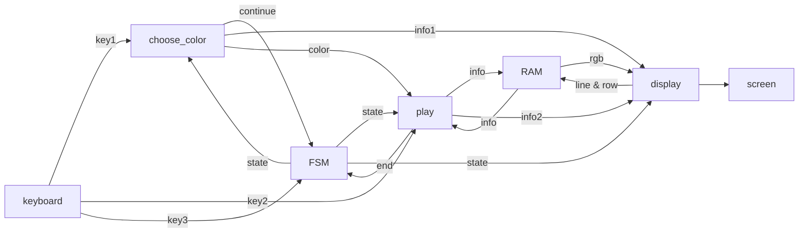
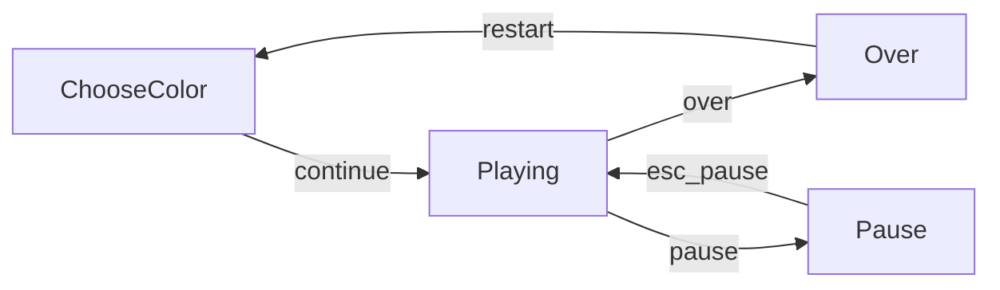
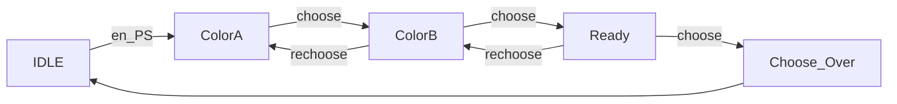
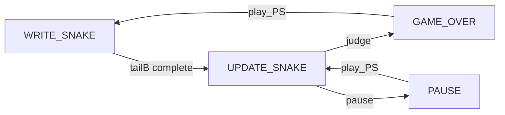
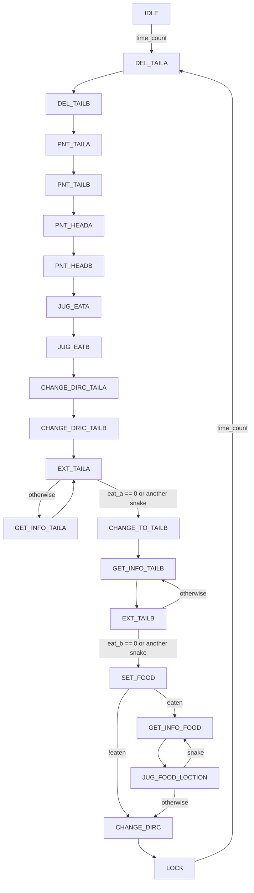

# <center>数电综合实验——贪吃蛇设计</center>

## 数据通路



| 线路名 |            具体内容            |        特别说明        |
| :----: | :----------------------------: | :--------------------: |
|  key1  |       back, enter, space       | 重选、选定、下一种颜色 |
|  key2  |          ↑ ↓ ← → WASD          |        方向操控        |
|  key3  |         pause, restart         |       暂停、新局       |
| info1  |          state, color          |      使能立即发出      |
| info2  | who_win, food_time, food_count |           \            |


## 核心元件的设计

### 界面设计


### Game_Board

* 实现方法：**BRAM**
* background VRAM
  * Depth = 750(50 * 150)
  * Width = 1(设每个位置存储数据为k)
  * True Dual, Always Enabled
  * No Register

* gameboard VRAM
  * Depth = 5625(75 * 75)
  * Width = 16(**设每个位置存储数据为k**)
  * True Dual, Always Enabled
  * No Register

| k[1 : 0] | 当前格子的状态 |
| :------: | :------------: |
|    00    |      无蛇      |
|    01    |      蛇A       |
|    10    |      蛇B       |
|    11    |      食物      |


| k[3 : 2] | k[1:0] == 2'b11：食物类型 | k[1:0] != 2'b11：蛇经过这里时的方向 |
| :------: | :-----------------------: | :------------------------------: |
|    00    |         N/A         |          左（x减小）          |
|    01    |         N/A         |          右（x增大）          |
|    10    |          普通食物          |          上（y减小）          |
|    11    |          高级食物       |          下（y增大）          |

### Snake_Info

* 实现方法：reg 分开命名
* 数据意义
  * snake_head_x[7 : 0]：蛇头横坐标，范围**[0, 75)**
  * snake_head_y[6 : 0]：蛇头纵坐标，范围**[0, 75)**
  * snake_tail_x[7 : 0]：蛇尾横坐标，范围同上
  * snake_tail_y[6 : 0]：蛇尾横坐标，范围同上
  * body_color[11 : 0]：蛇身颜色（rgb）
  * head_color[11 : 0]: 蛇头颜色
  * dir[1 : 0]：蛇前进的方向

| dir | 蛇头的方向 |
| :----: | :----: |
| 00 | 左（x减小） |
| 01 | 右（x增大） |
| 10 | 上（y减小） |
| 11 | 下（y增大） |

* **功能：蛇头用于“画”，蛇尾用于“擦”或者“生长”**


### Main FSM




### Write Color




### 食物剩余量和食物倒计时

```verilog
	//foodnum
    for(i = 0; i < 6; i = i + 1) begin
        for(j = 0; j < 6; j = j + 1)begin
            if(x >= FOODX + 6 * j && x < FOODX + 6 * j + 3 && 
               y >= FOODY + 6 * i && y < FOODY + 6 * i + 3)begin
                if(i * 6 + j < 36 - foodnum) begin
                    pdata = 12'h0;
                end
                else begin
                    if((i * 6 + j + 1) % 4 == 0) pdata = 12'h00E;
                    else pdata = 12'h48F;
                end
            end
        end
    end
    //food time left
    for(k = 0; k < 42; k = k + 6)begin  
        if(x >= TIMEX + k && x < TIMEX + k + 3 && y >= TIMEY && y < TIMEY + 3)begin
            if(k < 6 * (7 - food_time_left)) pdata = 12'h0;
            else pdata = 12'h00E;
        end
    end
```


### Play Core

> * time_count 的判断条件和time_per_step(游戏速度)有关
> * eat_a和eat_b在尾部加长后会不断递减，最终以是否为0作为循环跳出条件

#### 主状态机



#### UPDATE_SNAKE状态下的更新状态机




